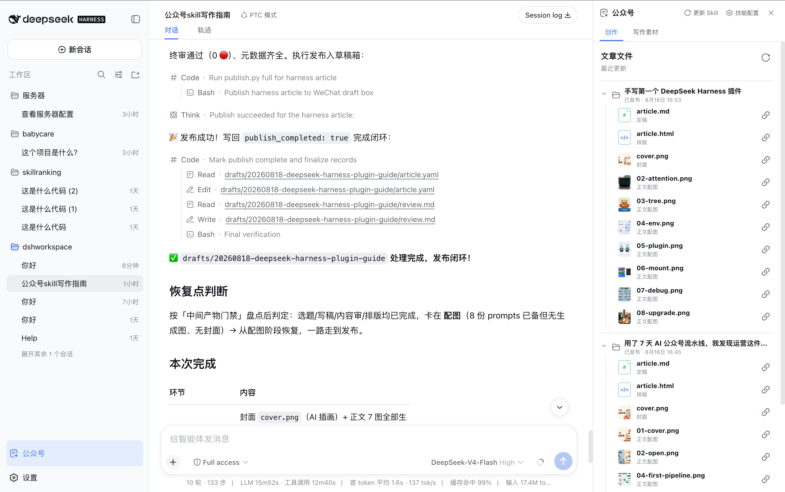
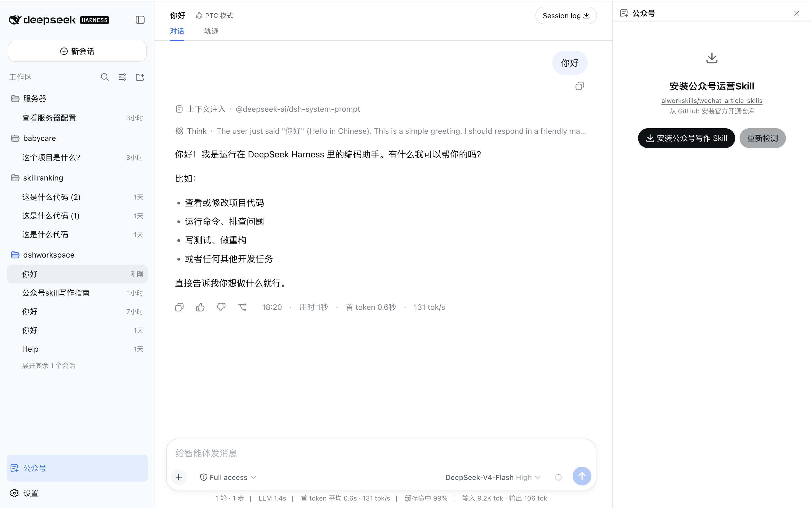
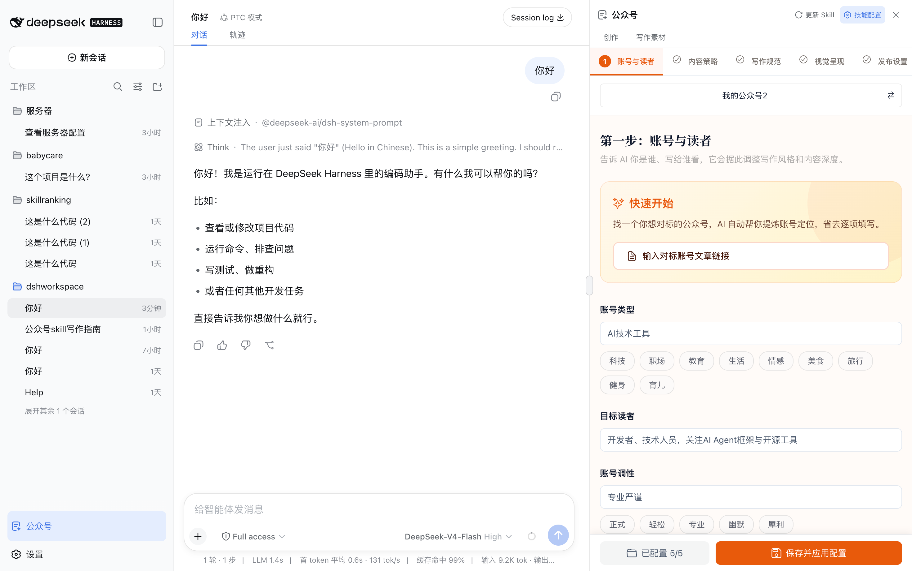
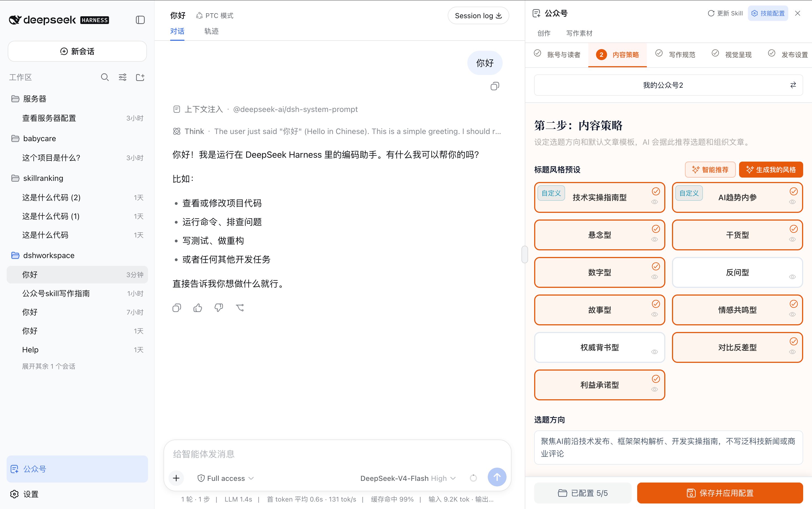
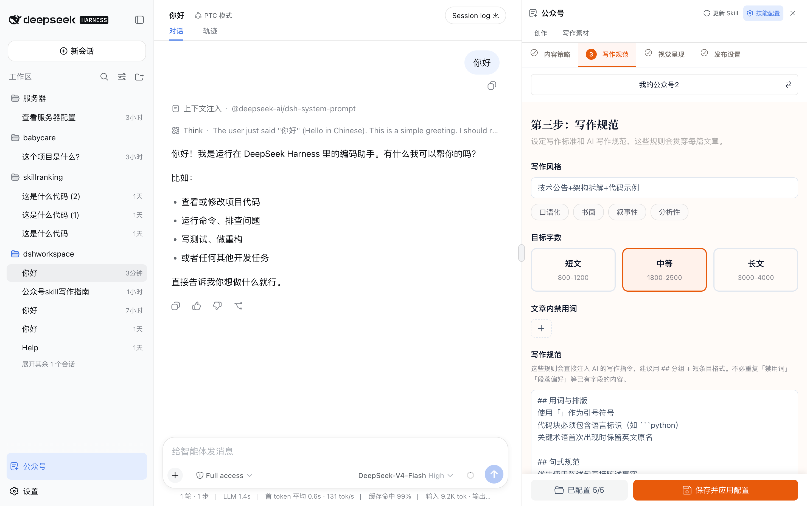
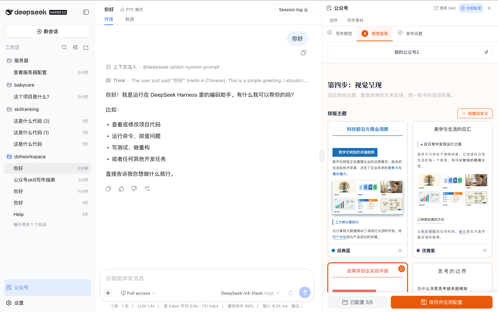
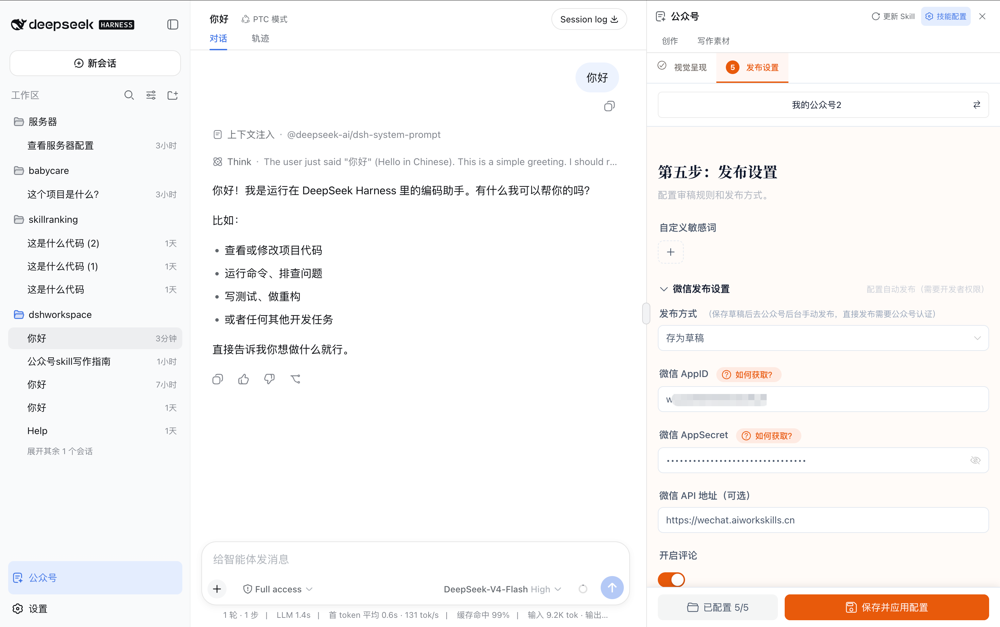
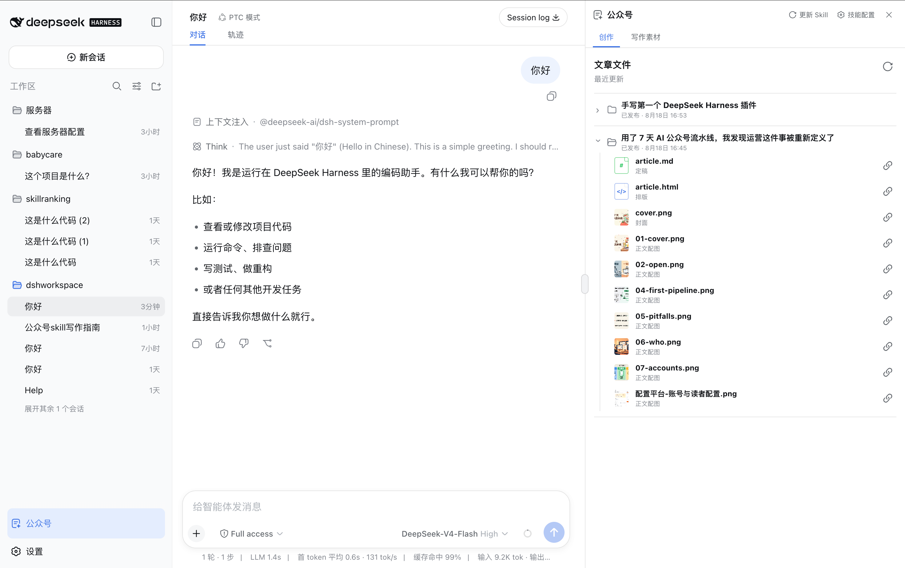
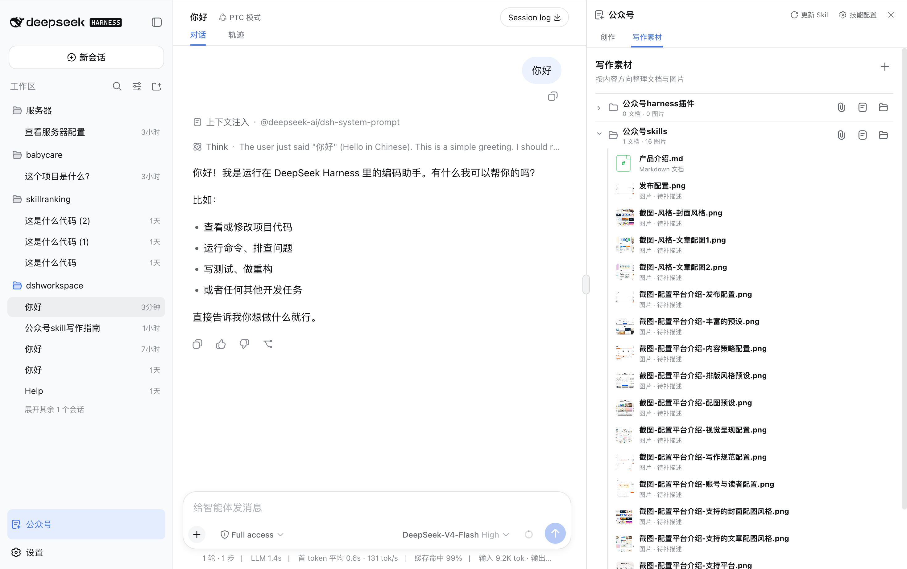

# aws-wechat-article

## 这是什么

`aws-wechat-article` 是一个运行在 [DeepSeek Harness](https://github.com/deepseek-ai/DeepSeek-Harness) 中的微信公众号创作插件。

安装后，你可以直接在 DeepSeek Harness 的对话中完成一篇公众号文章：

- 确定选题和标题
- 搜集、整理写作素材
- 撰写和修改文章
- 审稿与优化表达
- 生成公众号排版
- 生成封面和正文配图
- 发布到微信公众号草稿箱

整个过程仍然在对话中完成。插件在右侧增加了一个“公众号”工作台，帮助你查看文章定稿、排版文件和配图，也可以管理写作需要的产品资料与图片。



它不是另一套公众号写作方法，而是把开源项目 [wechat-article-skills](https://github.com/aiworkskills/wechat-article-skills) 接入 DeepSeek Harness。文章如何选题、写作、审稿、排版、配图和发布，仍然由原版 Skill 决定。

> 当前版本是社区预览版，适配 DeepSeek Harness `0.1.0-rc.5`。

## 怎么安装

当前版本需要从源码安装。安装前请准备：

- DeepSeek Harness `0.1.0-rc.5`
- Node.js `22.19`，或者 Node.js 24 及更高版本
- pnpm 11
- git

由于 DeepSeek Harness 仍处于 RC 阶段，本插件目前和 Harness 源码一起安装。在 macOS 或 Linux 终端中复制并执行下面的完整命令：

```bash
set -e

mkdir -p "$HOME/code/aiworkskills"

if [ ! -d "$HOME/code/deepseek-harness/.git" ]; then
  git clone https://github.com/deepseek-ai/DeepSeek-Harness.git \
    "$HOME/code/deepseek-harness"
fi

if [ ! -d "$HOME/code/aiworkskills/dsh-plugin/.git" ]; then
  git clone https://github.com/aiworkskills/dsh-wechat-article.git \
    "$HOME/code/aiworkskills/dsh-plugin"
fi

cd "$HOME/code/deepseek-harness"
pnpm install
pnpm run build

cd "$HOME/code/aiworkskills/dsh-plugin"
pnpm install
pnpm build

cd "$HOME/code/deepseek-harness"
pnpm dsh plugin --profile web add "$HOME/code/aiworkskills/dsh-plugin"
pnpm dsh web --port 3081
```

打开 `http://127.0.0.1:3081/`。安装成功后，左侧栏底部会出现“公众号”，插件管理页中只会显示一个插件：`aws-wechat-article`。

## 怎么使用

### 1. 打开一个公众号项目

在 DeepSeek Harness 中新建或打开一个会话，并选择一个本地文件夹作为工作区。这个文件夹将保存该项目的公众号配置、写作素材和文章文件。

点击左侧栏底部的“公众号”，右侧会打开公众号工作台。

### 2. 安装公众号写作 Skill

第一次打开时，点击“安装公众号写作 Skill”。

插件会从 GitHub 安装 [aiworkskills/wechat-article-skills](https://github.com/aiworkskills/wechat-article-skills)。安装只需要完成一次，以后右上角会显示“更新 Skill”。



Skill 没有打包在插件源码里。这样插件和 Skill 可以分别更新，你使用的也始终是公开仓库中的原版 Skill。

### 3. 完成公众号配置

安装 Skill 后，按照页面依次完成下面的公众号配置。

首先填写公众号定位、目标读者和默认作者，让智能体知道这个账号是谁、写给谁看。



然后选择内容策略，确定常写的文章类型、标题方向和内容结构。



接着填写写作规范，让生成的文章符合账号自己的语言习惯和内容要求。



选择排版、封面和正文配图风格，确定文章最终的视觉效果。



最后根据需要配置微信公众号发布信息。完成后，文章可以直接进入微信草稿箱或继续执行发布流程。



点击“保存并应用配置”后，配置会应用到当前项目。

以后需要调整时，可以点击右上角“技能配置”。悬停该按钮还可以选择在线配置、打开独立配置网站，或者直接打开本地配置文件夹。

### 4. 在对话中写文章

配置完成后，直接在主对话告诉智能体你想写什么，不需要在右侧工作台中点击“开始新文章”。

例如：

```text
写一篇介绍 DeepSeek Harness 插件体系的公众号文章，面向有 TypeScript
经验的开发者。先给我几个选题方向，确认后再继续写。
```

智能体会按照公众号 Skill 的流程推进，并在需要你做决定时停下来确认。中途退出后，也可以让它读取已有文章文件并继续处理。

### 5. 查看和修改文章文件

右侧“创作”页面按最近更新时间显示每篇文章。展开文章后，可以看到：

- Markdown 定稿或草稿
- HTML 排版文件
- 封面图片
- 正文配图

点击文件可以预览。点击文件右侧的引用按钮，可以把这份稿件或某一张图片放进主对话，然后针对它提出修改要求。



例如，引用一张正文配图后直接说：

```text
重新生成这张图片，保持原来的内容，但改成更简洁的科技媒体风格。
```

### 6. 管理写作素材

“写作素材”用于保存长期可复用的产品介绍、业务资料、案例和图片。

你可以创建多个内容方向，例如“公众号 Skills”“DeepSeek Harness”或某个具体产品。每个内容方向下面都可以上传文档和图片，也支持拖入文件、批量导入、预览、重命名和删除。



写文章时，只要告诉智能体使用哪个内容方向，它就会按照 Skill 的规则读取相关资料，并优先从对应图片中选择正文配图。

## 与开源生态的关系

这个项目由四个部分共同组成：

### DeepSeek Harness

[DeepSeek Harness](https://github.com/deepseek-ai/DeepSeek-Harness) 提供对话、智能体执行、工具调用、文件操作和插件系统。`aws-wechat-article` 作为一个独立插件安装到 Harness，不需要修改 Harness 源码。

### aws-wechat-article 插件

本仓库负责把公众号能力接入 Harness，包括：

- 左侧“公众号”入口和右侧工作台
- Skill 的安装与更新
- 配置页面接入和配置状态检查
- 文章文件的浏览、预览和引用
- 写作素材的上传与管理
- 产品资料和图片能力与智能体的连接

插件只负责连接和使用体验，不重新定义公众号写作流程。

### wechat-article-skills

[aiworkskills/wechat-article-skills](https://github.com/aiworkskills/wechat-article-skills) 是公众号创作能力的核心，定义了从选题到发布的完整方法、规则和脚本。

Skill 通过 GitHub 单独安装，插件不会复制、修改或内置它的源码。用户可以独立更新 Skill，也可以在其他支持 Skills 的智能体工具中使用它。

### aiworkskills.cn 配置工具

[aiworkskills.cn/config](https://aiworkskills.cn/config) 用于生成和维护公众号 Skill 的配置。插件直接接入已经部署的配置网站，不在插件中复制一份配置系统。

这种分工让每一部分都可以独立演进：

```text
DeepSeek Harness
    └── aws-wechat-article 插件
            ├── 安装并调用 wechat-article-skills
            ├── 接入 aiworkskills.cn/config
            └── 读取当前项目的文章与写作素材
```

文章、配置和写作素材都保存在用户自己的项目目录中，插件不建立另一份云端资料库。

本插件和上游 Skill 均采用 [Apache License 2.0](LICENSE)。

- 使用讨论：[GitHub Discussions](https://github.com/aiworkskills/dsh-wechat-article/discussions)
- 缺陷与建议：[GitHub Issues](https://github.com/aiworkskills/dsh-wechat-article/issues)
- 安全问题：请通过仓库 Security 页面私下报告，不要创建公开 Issue
